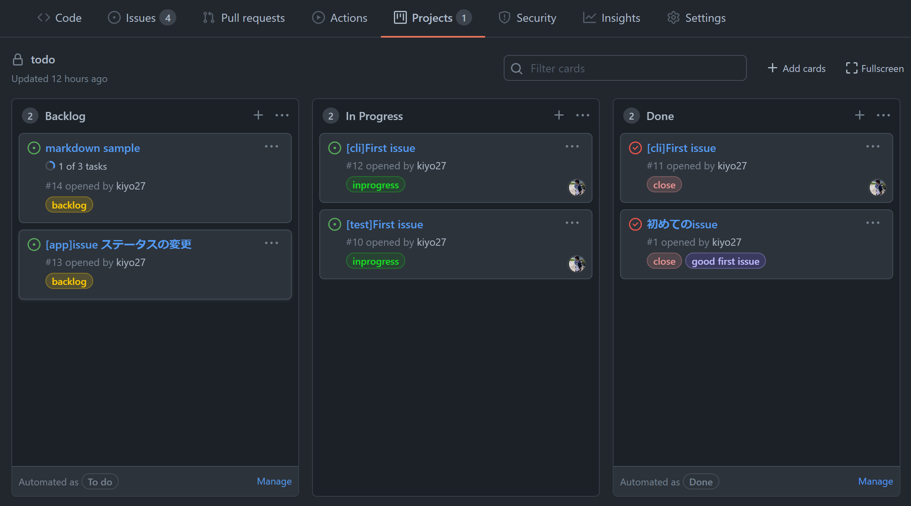

# GitHub Project Viewer for Terminal

GitHub Projects 専用のターミナルビューワー。ターミナル上で、プロジェクトボードと issue を確認できる。


## Prerequisite

- GitHubにプロジェクトボードが存在する
- api token を持っている



## Quick Start

リポジトリをクローンする

```
git clone git@github.com:kiyo27/gh-project-terminal-viewer.git
```

プロジェクトに移動する

```
cd gh-project-terminal-viewer
```

node module をインストールする

```
npm install
```

config ファイルを作成する

```
cp config.yaml.sample config.yaml
```

sample ファイルから config ファイルを作成したら、``repository``,``owner``,``access_token``を自分の環境に合わせて変更する

```
repository: YOUR_REPOSITORY
owner: YOUR_NAME
access_token: YOUR_PERSONAL_ACCESS_TOKEN
columns:
  - Backlog
  - In Progress
  - Done
```

config ファイルを修正したら、app を立ち上げる

```
node app.js
```
