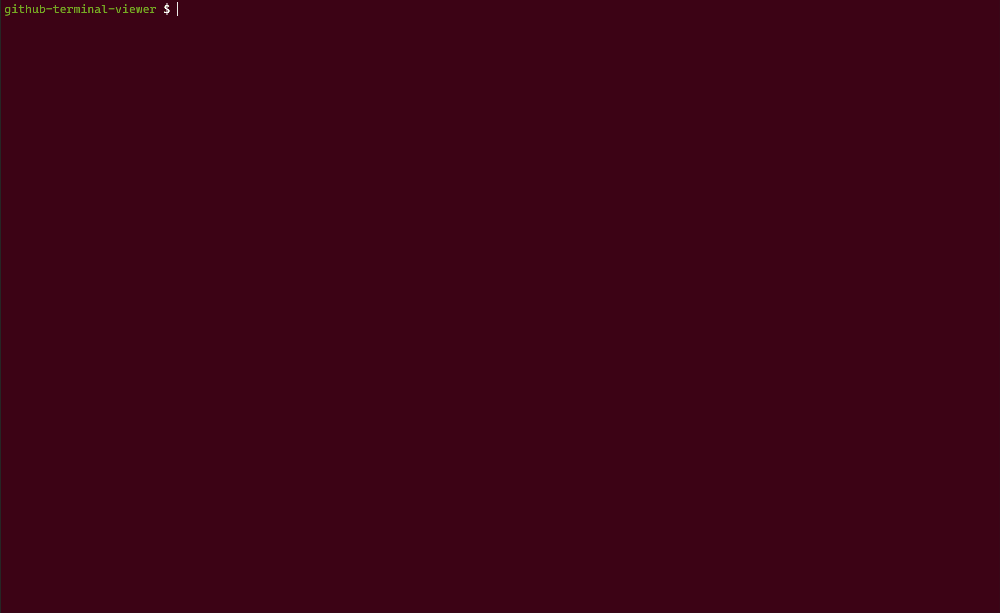
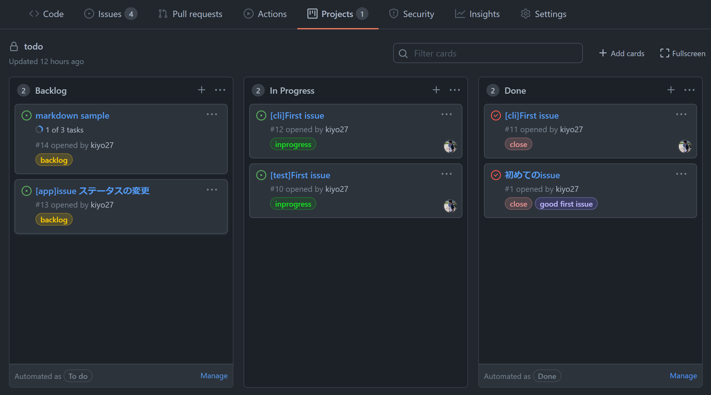

# gh-board: GitHub Project Viewer for Terminal

GitHub Projects 専用のターミナルビューワー。ターミナル上で、プロジェクトボードと issue を確認できる。



プロジェクトボード



## Prerequisites

[個人アクセストークン](https://docs.github.com/ja/authentication/keeping-your-account-and-data-secure/creating-a-personal-access-token)を持っている。


## Auto creation

``gh-board``で表示させたいプロジェクトボードがまだ作成されていない場合は、このセクションの手順を実行することで自動的に作成できる。すでにプロジェクトボードを持っている場合は、[次のセクション](#execution)を実行することでターミナル上でプロジェクトボードを表示させることができる。

ソースコードと実行環境が含まれている Docker image が用意されている。次のコマンドを使用して最新の Docker image をダウンロードする。

```
docker pull ghcr.io/kiyo27/gh-board:0.1.0-beta
```

``gh-board``で表示したいプロジェクトボードとプロジェクトボードが紐づいているリポジトリを環境変数で設定する。もし環境変数で設定したリポジトリが GitHub 上に作られていなければ、同名のリポジトリが自動的に作成される。プロジェクトボードも同様にリポジトリ内に存在していなければ、自動的に作成される。``gh-board``と GitHub 間で API 通信を行うため、GitHub から設定・取得した個人アクセストークンも環境変数に設定する。

```
docker run -it --rm \
    -e REPO_OWNER=<repository owner> \
    -e REPO_NAME=<repository name> \
    -e PROJECT_NAME=<project board name> \
    -e ACCESS_TOKEN=<personal access token> \
    ghcr.io/kiyo27/gh-board:0.1.0-beta --init
```

``REPO_NAME``が環境変数として設定されていない場合は、``board-sample``というリポジトリが作成される。``PROJECT_NAME``が設定されていない場合は、``SampleProject``が作成される。

| 環境変数 | 説明 | 必須 | デフォルト |
| --- | --- | --- | --- |
| REPO_NAME | リポジトリ名 | | board-sample |
| REPO_OWNER | リポジトリの所有者 | required | |
| PROJECT_NAME | プロジェクトのボード名 | | SampleProject |

``--init``フラグをつけて Docker image を起動すると、環境変数で設定されたリポジトリがまだ作られていない場合は作成し、プロジェクトボードが自動的に作成される。

## Execution

``gh-board``で表示させたいプロジェクトボード、プロジェクトボードが紐づいているリポジトリ名などを環境変数として設定する。

```
docker run -it --rm \
    -e REPO_OWNER=<repository owner> \
    -e REPO_NAME=<repository name> \
    -e PROJECT_NAME=<project board name> \
    -e ACCESS_TOKEN=<personal access token> \
    ghcr.io/kiyo27/gh-board:0.1.0-beta --up
```

``--up``フラグをつけて Docker image を起動すると、ターミナルアプリが起動される。

**設定可能な環境変数**

| 環境変数 | 説明 |
| --- | --- |
| ACCESS_TOKEN | GitHub の個人アクセストークン |
| REPO_NAME | リポジトリ名 |
| REPO_OWNER | リポジトリの所有者 |
| PROJECT_NAME | プロジェクトのボード名 |
| KANBAN_COLUMNS | カンバンのカラム名。カラム名を指定するときは、カンマ区切りで設定する（例：``KANBAN_COLUMNS="Backlog,In Progress,Done"``）。デフォルトは``Backlog``、 ``In Progress``、``Done``。 |
